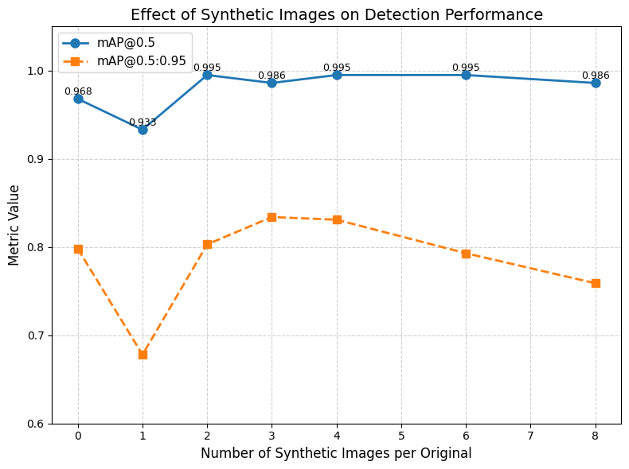

# Agenda 10

## **Roadmap**

1. Organize and update existing resources	**this week**
2. Improve the current YOLO experiments       **this week**
3. Refine the data generation workflow          **next 2 weeks**
4. Questions for upcoming planning

### Organize existing resource

1. Organize current custom node code, workflow code, YOLO experiment code;

2. Write related documentations, and synchronize everything to GitHub.

### Current YOLO experiment

1. Explore different filter-ranking strategies (mixed, random, ...)

2. Investigate performance degradation when using 1:1 synthetic and real data

   

3. Expand real test data while keeping the training and validation set sizes unchanged.

### Refine the data generation workflow 

1. develop a **custom multi-scale Canny node**, applying multiple thresholds, then merging the results (via union or weighted fusion).

2. use **CLIP/DINO-based scoring** to rank multiple Canny results and select the best one for ControlNet input (uncertain effectiveness, especially for long-tail cases).
3. Valid effect on current YOLO model performance

### **DICTA Conference**

1. Want to know what expenses can be covered by training allowance and reimbursement process.

2. Also want to know possible visit arrangement with Swordfish Computing during conference.

Regarding the holiday schedule for the university and Swordfish Computing during the Christmas period. Want to have a plan in advance.

