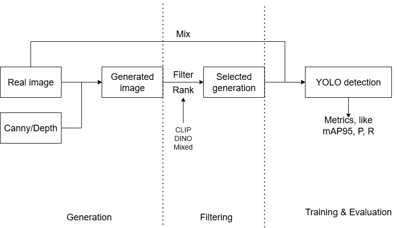
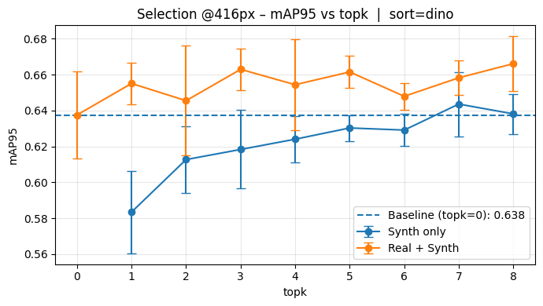
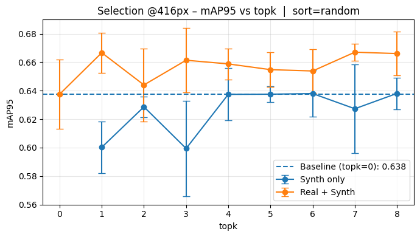
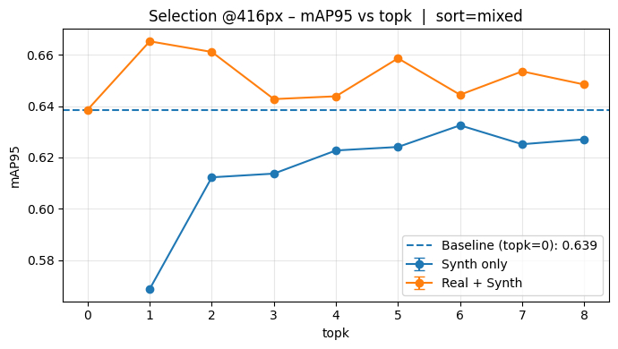

# Agenda 11

## Summary

1. Organize existing resources and explain current work
2. Revise the current YOLO experiments 

## **Roadmap**

1. Refine the data generation workflow          **next 2 weeks**

   1. prompt construction (instead of fixed prompt)
   2. canny map 
   
   

### Organize existing resource

1. Organize current custom node, generation and training YOLO code;

2. Write related documentations, and synchronize to GitHub.

   

Current code work include:

1. Implemented custom **ComfyUI** nodes to generate images from a single input image, with built-in scoring.

2. Developed a workflow script to **batch-ingest** image inputs and produce generated outputs.

3. Using the existing **real** and **synthetic** (from previous 2 steps) datasets, constructed YOLO **train** and **validation** datasets via the selected filtering strategy, and evaluated metrics on the **test** set.

   

### Preliminary YOLO experiment

1. **Filter–ranking strategies under evaluation:** CLIP, DINO, mixed, and random.
2. **Training setup:**
   - **Data:** 80 original training images, each augmented with **8 synthetic** images; 22 images for validation; 821 images for testing.
   - **Model:** `yolov8s`.
3. **Reproducibility:** Except for **mixed**, all sorting strategies are trained **three times** and **averaged** (seeds **6, 7, 42**).

|  |  |
| :-----------------------: | :-----------------------: |

|  |  |
| :-------------------------: | :--------------------------: |

**Preliminary Findings:**

- Adding synthetic images to the training set yields a small but consistent gain (~+0.02) in the metrics.
- CLIP-only selection performs poorly.
- Training on synthetic-only data cannot replace real data.

Could you please confirm the reimbursable items—are flights and accommodation covered? are meals also covered

May I go ahead and book the tickets now? 

Will the invoices/receipts be sufficient for reimbursement?

When should I expect the scholarship funds to be disbursed?

For the PhD application, is it advisable to submit as early as possible? Could you give me a timeline for the application?

Do you have any guidance or a template/outline for the Research Proposal (RP), including preferred structure, length, and formatting?
