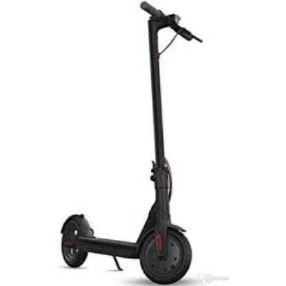
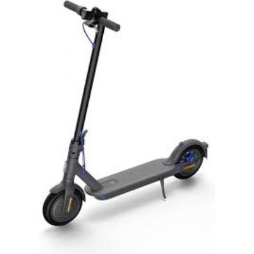
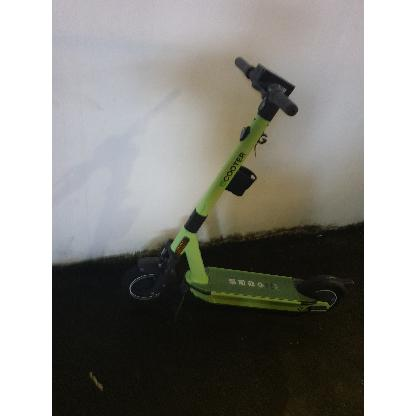
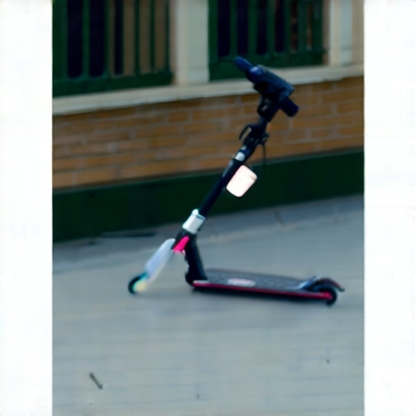
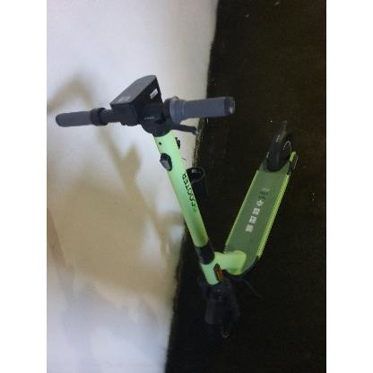
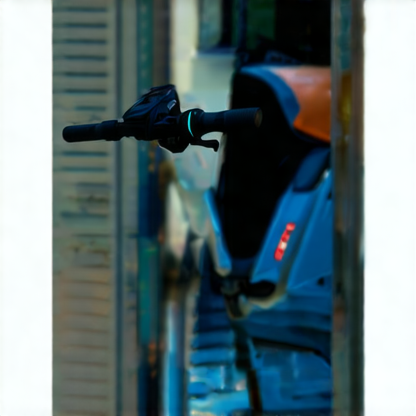

# Agenda 8

## summary

1. Presentation preparation
2. Built an automated workflow for the *scooter* dataset

## **Roadmap**

1. Revise the presentation slides and add more illustrative images  **next week**
2. Apply YOLO and others to the generated dataset and evaluate performance metrics **next week**
3. Refine the data generation workflow based on model performance metrics  **the following 2 weeks **

### **Presentation**

There are no strict presentation guidelines, a grading criteria from CIS email:

**Grading Criteria:**

1. **Structure, Flow, and Argument (6 marks):**
   - Addressing the research question, explaining and justifying its importance
   - Selecting and justifying an appropriate method
   - Maintaining a coherent argument throughout the presentation
2. **Materials (2 marks):**
   - Effective use of visual resources (illustrations and figures)
3. **Presentation Technique (2 marks):**
   - Clear communication of the talk’s structure
   - Engagement with the audience and ability to answer questions

What will the Q&A mainly focus on?

### **Automated Workflow**

Use a Python script to automate the workflow on the *scooter* dataset (93 images).
Each image generates 8 augmented versions, and both CLIP and DINOv2 embeddings are computed.

some points: 

1. Due to ComfyUI’s node-saving limitations (unable to specify a custom save directory), write a custom save image node.

2. Many *scooter* images lack background scenes.

   |  |  |
   | :------------------: | :------------------: |

3. Several images in the dataset are padded to 416×416 square, resulting in white borders that degrade generation quality.

   Plan: preprocess images to remove borders (while preserving information), then generate and repad to 416×416.

   |  |  |
   | :-----------------------: | :------------------: |

4. The **SD3.5 model** performs poorly on objects captured at abnormal angles (e.g., rotated or skewed views), likely due to the lack of such samples in its training data.

   |  |  |
   | :------------------: | :---------------------: |

   |  |  |
   | :------------------: | :---------------------: |

5. The **Canny parameters** work well for some cases but limit the overall generation quality since they are fixed across the workflow.

   dynamic params

   Plan: develop a **custom multi-scale Canny node**, applying multiple thresholds, then merging the results (via union or weighted fusion).

   Alternatively, use **CLIP/DINO-based scoring** to rank multiple Canny results and select the best one for ControlNet input (uncertain effectiveness, especially for long-tail cases).

About the training fee, CSIRO said it should be made through the university’s own process.
